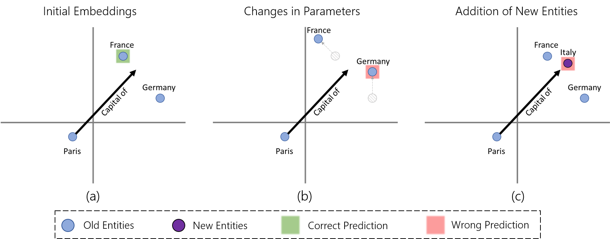

# Revisiting Catastrophic Forgetting in Continual Knowledge Graph Embedding

This is the repository associated to the paper *"Revisiting Catastrophic Forgetting in Continual Knowledge Graph Embedding"*. In there, we argure that the evaluation of catastrophic forgetting (i.e., the loss of previous performance when learning new tasks) in Continual Knowledge Graph Embeddings (CKGE) is not complete. Specifically, existing works focus on monitoring the changes in already exsiting embeddings (embedding drift) but forget about the loss in performance originated by densification of the embedding space when new entities are introduced (entity interference).

This can be exemplified in the figure above. The scenario in the left (a) corresponds to the initial scenario, where the model predicts that *France* is the most likely entity the complete the triple *(Paris, Capital of, ?)*. After introducing new information to the Knowledge Graph and updating the KGE, the existing embeddings may have changed, and as exemplified in (b), the previous correct prediction may now be incorrect. This is what is understood as **embedding drift**. However, another scenario could happen (c), where new entities are introduced close to the existing ones, and now the prediction is incorrect because of them, a phenomenon we refer as **entity interference**.

The latter has been overlooked in the literature. First, the catastrophic forgetting mitigation strategies proposed in CKGE methods are not designed to address it. Second, and more importantly, entity interference has been excluded from the evaluation. This is, in the scenario (c) in the figure above, a correct prediction is reported, as if one removes the new entities, the previous correct prediction is obtained. This does not reflect the behavior of growing Knowledge Graphs.

## Fixing the Evaluation
In this repository, we explain how to correcly evalaute CKGE by taking entity interference into account. First, as the vast majority of CKGE works are build on the same CKGE framework and share the same evaluation protocol, the exact changes are presented. Finally, for those who want to implement their own evaluation protocol, the corrected evaluation needs are highlughted.

### Standard CKGE Evaluation Protocol

Exisiting works in the literature are based on the implementation presented in *"Lifelong Embedding Learning and Transfer for Growing Knowledge Graphs"*, inheriting the evaluation protocol. Therefore, we present which are the changed needed to report an acurate evaluation:

1) In the *TestDataset* class from the *data_loader.py* file, the function *get_label* should include all the entities up to the current snapshot in the testing phase:
```python 
def get_label(self, label):
        '''
        Filter the golden facts. The label 1.0 denotes  golden answer.
        :param label:
        :return: dim = test factnum * all seen entities
        '''
        if getattr(self.args, "full_entities", None) is not None:
            num_ent = self.args.full_entities
            y = np.zeros([num_ent], dtype=np.float32)
        else:
            if self.args.valid:
                y = np.zeros([self.kg.snapshots[self.args.snapshot].num_ent], dtype=np.float32)
            else:
                y = np.zeros([self.kg.snapshots[self.args.snapshot_test].num_ent], dtype=np.float32)
        for e2 in label: y[e2] = 1.0
        return torch.FloatTensor(y)
```
2) In the *predict* function of the *BaseModel* class, again the entities to be considered in the test phase should be the total entities present in the current snapshot:
```python 
def predict(self, sub, rel, stage='Valid'):
        '''
        Scores all candidate facts for evaluation
        :param head: subject entity id
        :param rel: relation id
        :param stage: object entity id
        :return: scores of all candidate facts
        '''

        '''get entity and relation embeddings'''
        if stage != 'Test':
            num_ent = self.kg.snapshots[self.args.snapshot].num_ent
        elif getattr(self.args, "full_entities", None) is not None:
            num_ent = self.args.full_entities
        else:
            num_ent = self.kg.snapshots[self.args.snapshot_test].num_ent
        ent_embeddings, rel_embeddings = self.embedding(stage)
        s = torch.index_select(ent_embeddings, 0, sub)
        r = torch.index_select(rel_embeddings, 0, rel)
        o_all = ent_embeddings[:num_ent]
        s = self.norm_ent(s)
        r = self.norm_rel(r)
        o_all = self.norm_ent(o_all)

        '''s + r - o'''
        pred_o = s + r
        score = 9.0 - torch.norm(pred_o.unsqueeze(1) - o_all, p=1, dim=2)
        score = torch.sigmoid(score)

        return score
```
3) Finally, in the *continual_learning* loop inside the *main.py* file, when entering the testing phase the current total number of entities must be stored:
```python 
self.args.full_entities = self.kg.snapshots[ss_id].num_ent
```

and then emptied:
```python 
self.args.full_entities = None
```

### Own CKGE Evaluation Protocol


KGEs are evaluated using the Link Prediction task. The rank of the correct entity (h, r, t) is computed as:

$$
\mathrm{rank}(h,r,t) = 1 + |\{ t' \in \mathcal{E} \mid 
p_{\mathcal{M}}(h,r,t') > p_{\mathcal{M}}(h,r,t) \text{ and } (h,r,t') \notin \mathcal{S} \}|
$$

Where:  
- $\mathcal{E}$ = candidate entity set  
- $p_{\mathcal{M}}$ = model scoring function  
- $\mathcal{S}$ = set of known true triples (for filtered evaluation)

#### Correct Evaluation

Use the current entity set $\mathcal{E}_i$ for ranking, regardless of which snapshot the test triple belongs to. This is, for a test set $\Delta \mathcal{G}_j$ with $j < i$, compute ranks using $t' \in \mathcal{E}_i$, not restricting candidates to the entity set from the snapshot when the triple was observed ($\mathcal{E}_j$).

#### Implication

Using $\mathcal{E}_j$ instead of $\mathcal{E}_i$ overestimates results:

$$
\theta_j^j \ge \theta_j^i, \quad \forall j < i
$$

Where $\theta_j^k$ denotes the evaluation metric on test set $\Delta \mathcal{G}_j$ using entity set $\mathcal{E}_k$.

## Reproducing the Results

To obtain the results reported in the paper, the following steps need to be performed:

1. Install the CKGE method repository following the directions specified. The CKGE methods used can be found here:
    - [LKGE](!https://github.com/nju-websoft/LKGE), also including EMR, EWC and finetuning
    - [incDE](https://github.com/seukgcode/IncDE)
    - [FastKGE](https://github.com/seukgcode/FastKGE)
    - [FMR](https://github.com/lijingzhu1/FMR)
    - [ETT-CKGE](https://github.com/lijingzhu1/ETT-CKGE)
    - [DebiasedKGE](https://anonymous.4open.science/r/DebiasedKGE)
    - [SAGE](https://github.com/yayayacc/SAGE)
2. Move the 8 benchmark datasets (found in the datasets directory from this repository) inside the *data* directory.
3. Replace, as explained in the previous section, the different parts of the provieded scripts to obtain the corrected evaluation protocol.
4. Run the experiments with the best hyperparameter configuration reported in each repository.